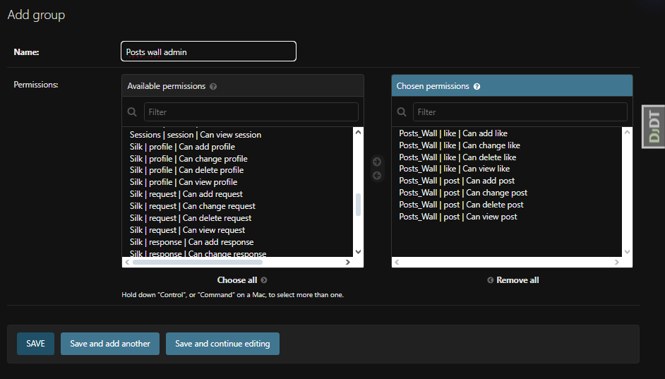
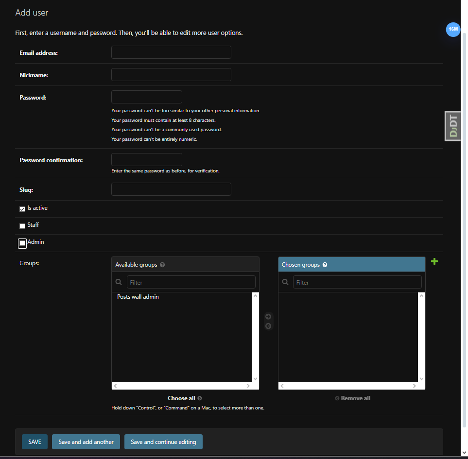
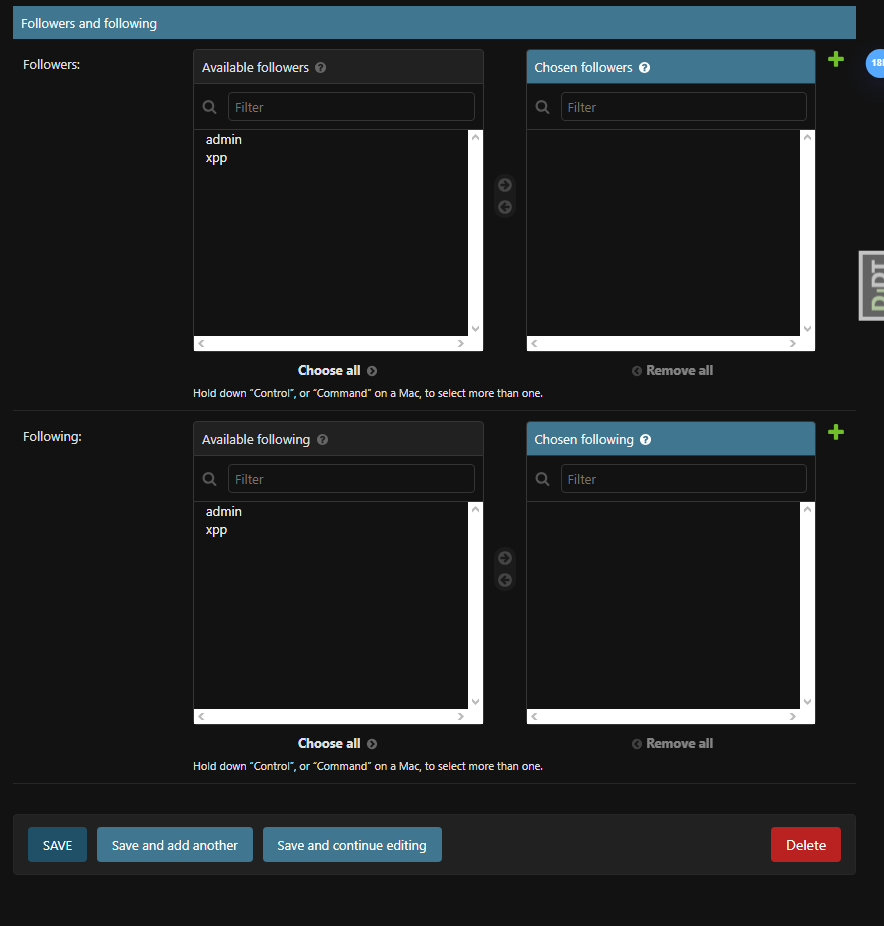

# App like twitter
A simple application in the style of the popular x.com that allows users to create accounts, posts, tags, comments and give follow up posts, users

## How to run 
This section will appear when I finish the project 

##  App-like twitter backend frontend:
This section will appear when I finish the frontend 

## App like twitter backend endpoints:

### Admin 
###### To create an admin account, type `python manage.py createsuperuser`
Access to admin panel http://127.0.0.1:8000/admin/
In the admin tab, we have access to the comments section, posts, tags and users and groups

#### Groups-Aadmin
In the groups tab we can create groups of users give and take away their permissions  

#### Comments-Aadmin
Ability to create and modify or delete comments 

#### Posts-Aadmin
The post tab allows you to create or delete and modifications to the posts and comments of a given post it is mandatory for a post to have a tag and text

#### Tags-Aadmin
The tags tab allows you to create delete and edit tags that cannot be repeated.

#### Users-Admin
In the users tab when editing a user's profile we can change the email address nickanem avatar add or take away staff permissions or any other perrmissions is visible password, although it is encrypted with pbkdf2_sha256 you can still manage followers and following. It is also possible to set IS ACTIVE and FREEZE OR NOT the user account from the beginning of its creation is active, but FREEZE OR NOT is set to TRUE, which causes the lack of any possible actions to be performed by opening the sent email and clicking on the link. In addition, when creating a new user it is possible to create an admin account

### Posts wall
Access to posts wall http://127.0.0.1:8000/p_w/

 #### 1.User Post Manager
 Access to user post maneger http://127.0.0.1:8000/p_w/user-post-manager/
 To access this endpoint you must have a jwt token generated for the user in question sent through, for example, ModHeader otherwise HTTP 401 Unauthorized is returned.
 
 
 
 
 When creating a post, provide existing tags and text the rest of the fields are optional. 
 
 

By going to the post via http://127.0.0.1:8000/p_w/user-post-manager/POST_ID/. The post can be edited or deleted.

 #### 2.SearchPostByTags
 To access the post search by tag http://127.0.0.1:8000/p_w/search-post-by-tags/ this function searches for posts with a particular tag. The given tag should be specified in slug 
?tag_name=%23TAG_NAME for example
http://127.0.0.1:8000/p_w/search-post-by-tags/?tag_name=%23DJANGO
 
 
 

 #### 3.ShowUserPosts
Show user posts page shows posts depending on whether user is logged in or is anonymous

### Tags
 1.UserTagsListView
 2.GetAllUsersTagsView

### Sending
 1.send_activation_email
 2.ActivationView 
 3.ResendActivationView

### Users
 1.FollowAndUnFollowUserView
 2.FollowersAndFollowingBaseView
 3.MyUserViewSet
 4.ResetPassword
 5.YourFollowersView
 6.YourFollowsView
 7.FollowUserView
 8.UnFollowUserView
 9.SearchUserProfile
 10.UserPosts
Simple-jwt is responsible for user authentication
jwt-create / http://127.0.0.1:8000/u/jwt/create
jwt-refresh / http://127.0.0.1:8000/u/jwt/refresh
jwt-verify / http://127.0.0.1:8000/u/jwt/verify

