# App like twitter
 A simple application in the style of the popular x.com that allows users to create accounts, posts, tags, comments and give follow up posts, users

## How to run 
 This section will appear when I finish the project 

##  App-like twitter backend frontend:
 This section will appear when I finish the frontend 

## App like twitter backend endpoints:

### Admin 
###### To create an admin account, type `python manage.py createsuperuser`
 Access to admin panel http://127.0.0.1:8000/admin/
 In the admin tab, we have access to the comments section, posts, tags and users and groups

 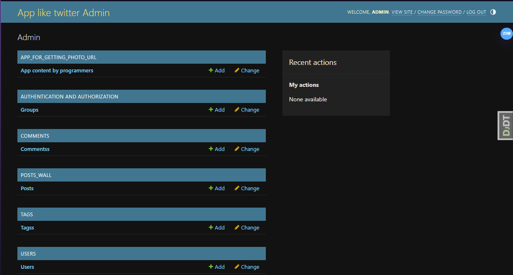

#### Groups-Aadmin
 In the groups tab we can create groups of users give and take away their permissions  

 
 

#### Comments-Aadmin
 Ability to create and modify or delete comments 

 
 

#### Posts-Aadmin
 The post tab allows you to create or delete and modifications to the posts and comments of a given post it is mandatory for a post to have a tag and text

 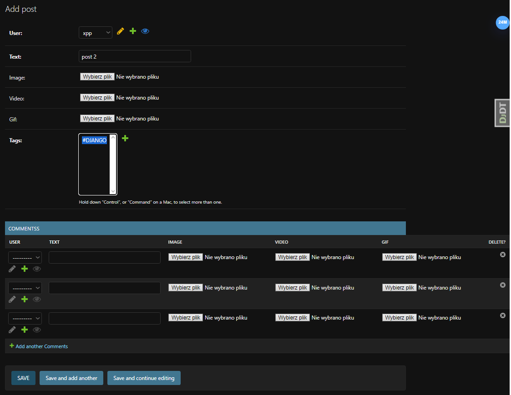
 

#### Tags-Aadmin
 The tags tab allows you to create delete and edit tags that cannot be  repeated.

 
 

#### Users-Admin
 In the users tab when editing a user's profile we can change the email    address nickanem avatar add or take away staff permissions or any other perrmissions is visible password, although it is encrypted with pbkdf2_sha256 you can still manage followers and following. It is also possible to set IS ACTIVE and FREEZE OR NOT the user account from the beginning of its creation is active, but FREEZE OR NOT is set to TRUE, which causes the lack of any possible actions to be performed by opening the sent email and clicking on the link. In addition, when creating a new user it is possible to create an admin account

 
 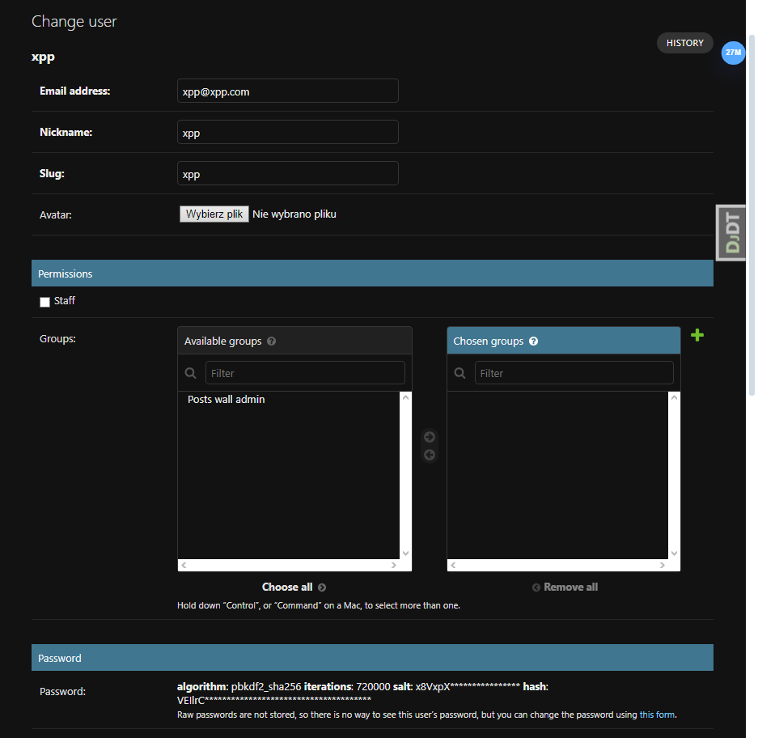
 
 

### Posts wall
 Access to posts wall http://127.0.0.1:8000/p_w/

 #### 1.User Post Manager
  Access to user post maneger http://127.0.0.1:8000/p_w/user-post-manager/
  To access this endpoint you must have a jwt token generated for the user in question sent through, for example, ModHeader otherwise HTTP 401 Unauthorized is returned.
 
 
 
 
  When creating a post, provide existing tags and text the rest of the fields are optional. 
  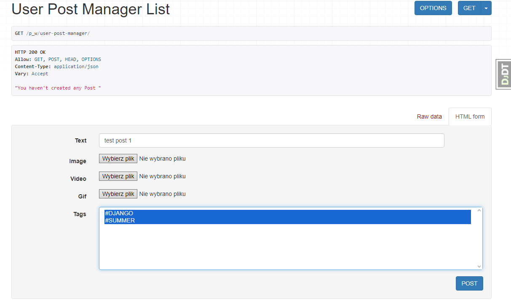
  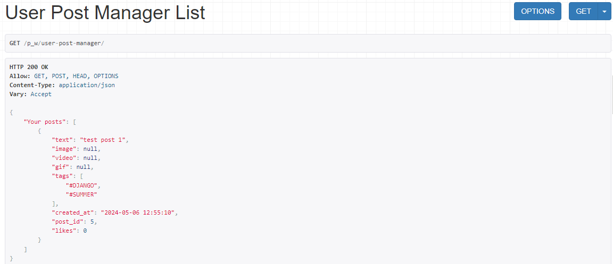

 By going to the post via http://127.0.0.1:8000/p_w/user-post-manager/POST_ID/. The post can be edited or deleted.
 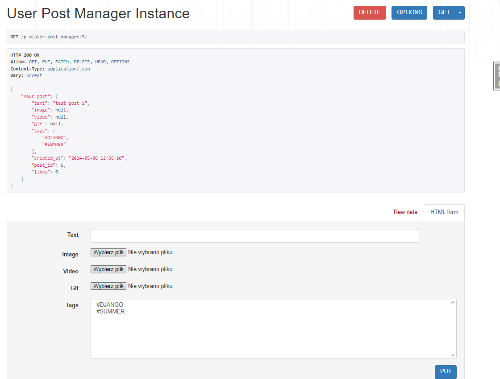

 #### 2.SearchPostByTags
  To access the post search by tag http://127.0.0.1:8000/p_w/search-post-by-tags/ this function searches for posts with a particular tag. The given tag should be specified in slug 
 ?tag_name=%23TAG_NAME for example
 http://127.0.0.1:8000/p_w/search-post-by-tags/?tag_name=%23DJANGO
 
 
 

 #### 3.ShowUserPosts
 Show user posts page shows posts depending on whether user is logged in or is anonymous
 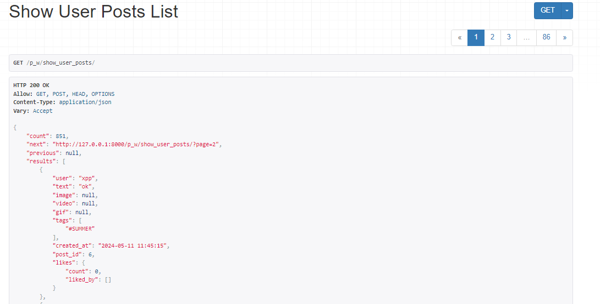
 
 #### 4.SowUsersComments
 To access the comments of a given post, send a request to http://127.0.0.1:8000/p_w/show_user_posts/POST_ID/comments/ then the entire list of comments of a given post will be displayed if you want to be able to add comments you need to send the jwt token in the header
 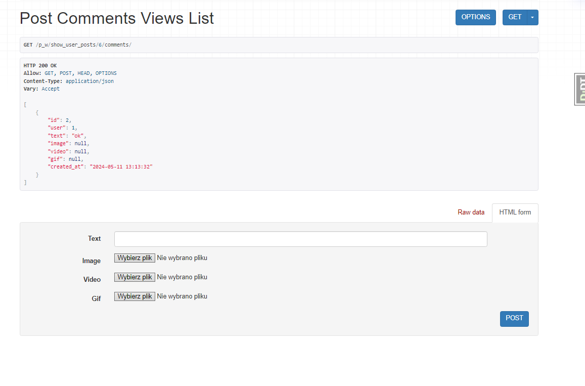

### Tags
 Tags are available at http://127.0.0.1:8000/t/

 #### 1.UserTagsList
 In order to access the User Tags List you need to submit a jwt token. The page shows the tags of a given user and allows you to create new ones.
 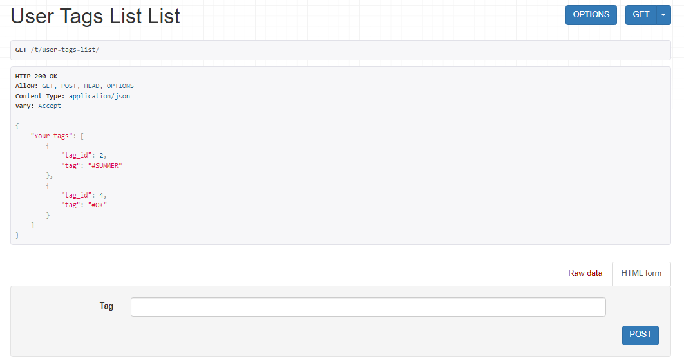

 #### 2.GetAllUsersTags
  Get All Users Tags List shows userwoi all tags created
 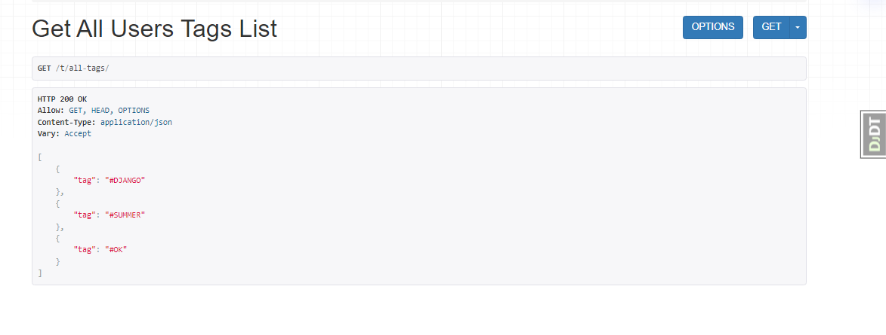

### Sending
 This section is used to activate the user account I use smp4dev to do this. The same mechanism is for resetting the password
 password change is available at http://127.0.0.1:8000/u/users/reset_password/

 #### 1.send_activation_email
  After creating an account, it automatically sends an email
 
 #### 2.ActivationView 
  
  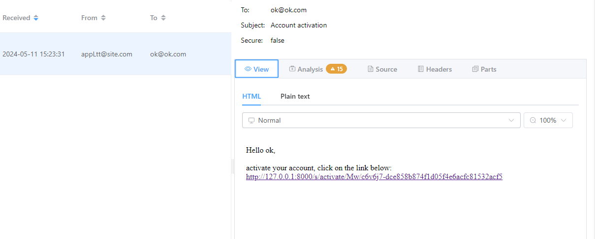

 #### 3.ResendActivationView
  Available at http://127.0.0.1:8000/u/users/resend_activation/
  email must be provided. Sends activation email again
  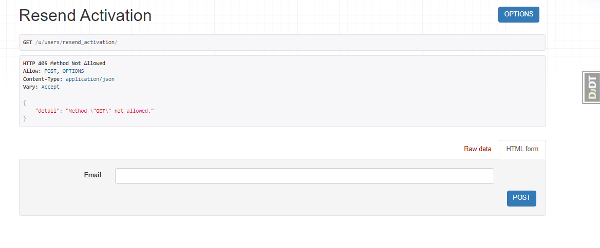 

### Users
 Users are available at http://127.0.0.1:8000/u/
 To access most of the useres features you need to send the jwt token in the  header 
 #### 1.MyUserView
  This option is available under http://127.0.0.1:8000/u/users/me/ first section displays JSON with basic account information. Next we can change nickname email avatar and status freeze or not
  

 #### 2.ResetPassword
  Password change is available at http://127.0.0.1:8000/u/users/reset_password/
  The mechanics of how it works is the same as in account activation you enter your email and a message is sent with a link to change your password

 #### 3.YourFollowersView
  This section shows the people who are watching the logged in user
  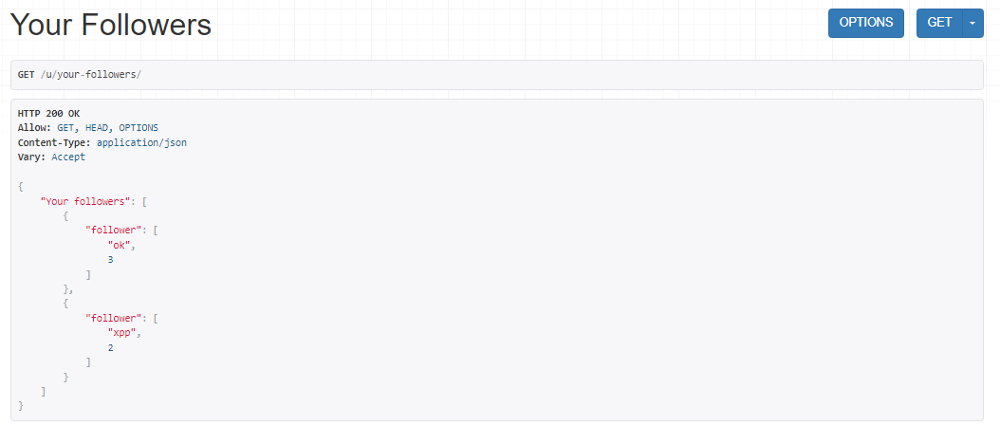
 #### 4.YourFollowsView
  This section shows the people the logged in user is watching
  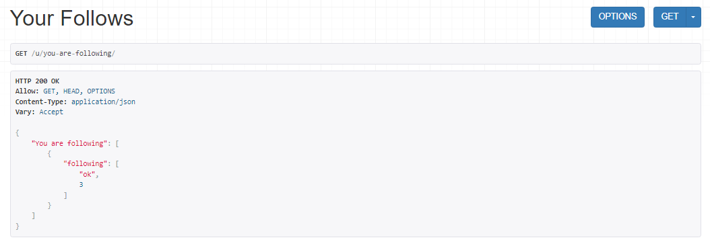
 #### 5.FollowUserView
  Here a user can give observations to another 
  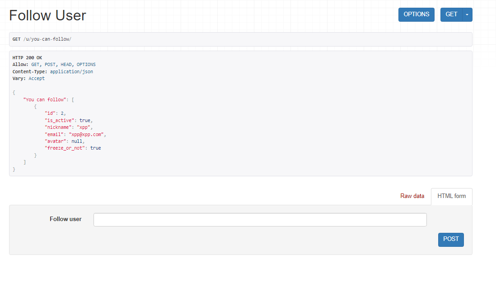
 #### 6.UnFollowUserView
  Here a user can take away observations from another 
  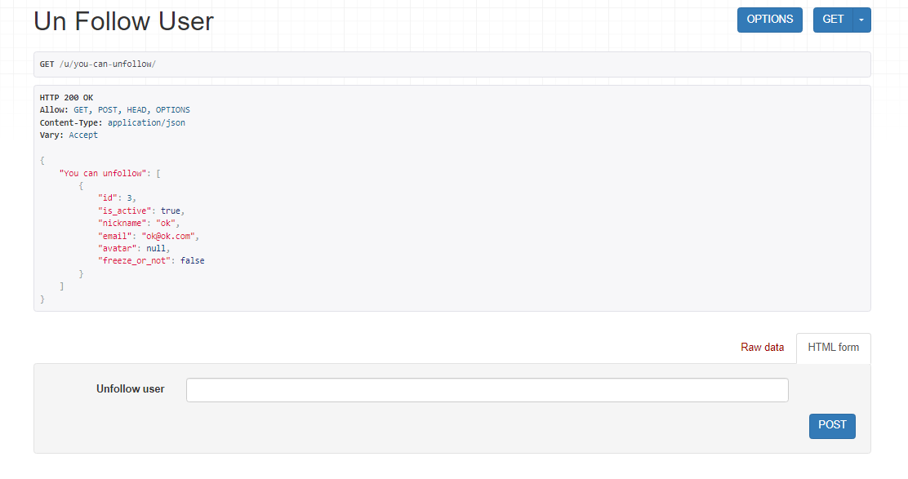
 #### 7.SearchUserProfile
  To search for a user's profile in slug, you need to 
  add /?user_name=USER_NICKNAME ex. 
  http://127.0.0.1:8000/u/search-user-profile/?user_name=admin
  you need to send jwt token to access this
  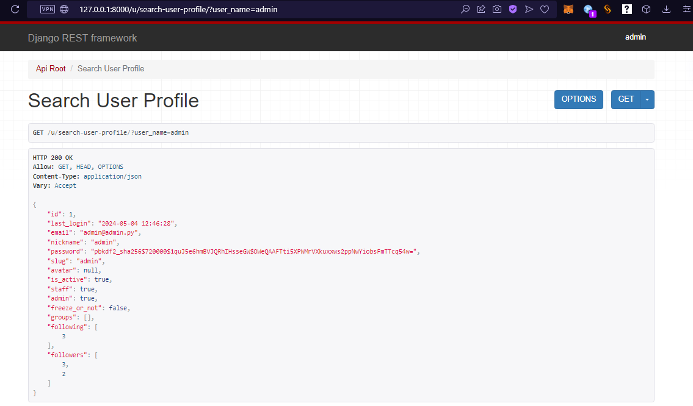
 #### 8.UserPosts
  To search for a user's posts in slug, you need to 
  add /?user_name=USER_NICKNAME ex. 
  http://127.0.0.1:8000/u/search-user-posts/?user_name=admin
  you need to send jwt token to access this
  

### Simple-jwt is responsible for user authentication
 #### jwt-create / http://127.0.0.1:8000/u/jwt/create
 #### jwt-refresh / http://127.0.0.1:8000/u/jwt/refresh
 #### jwt-verify / http://127.0.0.1:8000/u/jwt/verify

